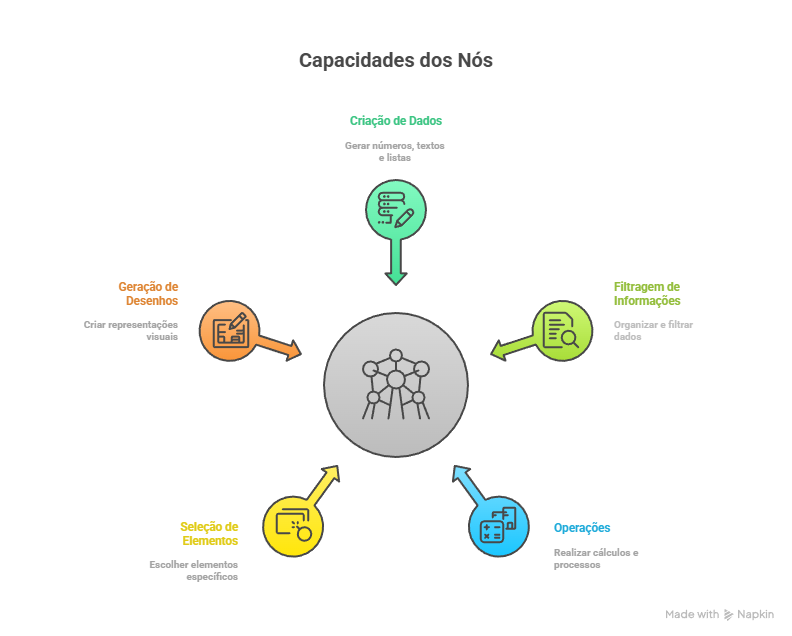

# 1.2 Programação visual

### A abordagem visual:

<figure><figcaption></figcaption></figure>

### A abordagem textual:

1. Comece com a ponta larga da gravata à direita e a ponta estreita à esquerda. A ponta estreita deve ficar ligeiramente acima do seu umbigo. Lembre-se de que você só vai mover a ponta larga durante o processo.
2. Cruze a ponta larga sobre a ponta estreita, indo da direita para a esquerda.
3. Leve a [ponta ](#user-content-fn-1)[^1]larga para cima e passe por baixo do laço no pescoço.
4. Desça a ponta larga para a esquerda.
5. Passe a ponta larga por trás da ponta estreita, indo da esquerda para a direita.
6. Suba novamente a ponta larga para o centro, em direção ao laço no pescoço.
7. Passe a ponta larga por dentro do laço no pescoço e desça para a direita.
8. Cruze a ponta larga na frente da gravata para a esquerda.
9. Suba a ponta larga novamente, passando por baixo do laço no pescoço.
10. Desça a ponta larga pelo laço que você acabou de criar na frente.
11. Aperte o nó puxando a ponta larga. Ajuste o nó subindo e arrumando para que ele fique bem firme e simétrico.

### A abordagem do aprendizado

Aprender algo novo fica muito mais fácil quando conseguimos ver o processo acontecendo. Um exemplo disso é dar um nó na gravata. Eu, por exemplo, nunca conseguiria fazer isso só lendo as instruções. Se eu tentasse seguir apenas as palavras, acabaria com um nó completamente torto. Mas, ao ver os movimentos passo a passo, tudo fica muito mais claro e menos complicado. Visualizar a ação torna uma tarefa que parecia difícil algo simples e acessível, especialmente no primeiro contato com algo novo.

***

### No code, low code e afins

Provavelmente você já deve ter ouvido os termos "low code" ou "no code". Esses termos se referem a uma linguagem de programação visual que permite criar programas conectando blocos gráficos em vez de escrever código. Em vez de digitar comandos, você constrói sua lógica arrastando e ligando elementos visuais que representam operações e dados.

Esse tipo de abordagem é ideal para quem quer focar na lógica e na solução dos problemas, sem se preocupar com detalhes técnicos.

Além disso, a programação visual é extremamente intuitiva, tornando-se uma excelente porta de entrada para quem nunca programou antes. Como tudo é representado visualmente, fica mais fácil entender o fluxo de informações.

***

### Construindo um círculo no Eberick

* Manualmente:

<figure><figcaption></figcaption></figure>

> 1. Escolher o nível
> 2. Clicar no comando Círculo&#x20;
> 3. Clicar no ponto do centro&#x20;
> 4. Clicar no ponto tangente
> 5. Acessar as propriedades do círculo

***

* Automatizando com o Nodes:

<figure><figcaption></figcaption></figure>

> 1. Informar o centro do círculo através do nó "Ponto", criado com as entradas x e y, preenchidas pelos valores do nó "Número".
> 2. Informar o raio do círculo, utilizando um nó "Número".&#x20;
> 3. Escolher o nível do desenho com um nó de seleção chamado "Nível".&#x20;
> 4. Informar se o círculo será preenchido (verdadeiro) ou não (falso) com um nó "Booleano".

***

### Textual x visual

Imaginando que existisse uma linguagem textual capaz de realizar a mesma automação de gerar o desenho de um circulo, podemos abstrair e imaginar que o algoritmo abaixo seria o correto para obter o mesmo desenho:&#x20;

```lua
    pontoCentral ← criarPonto(0.0, 0.0)
    raio ← 10.0
    nivelEscolhido ← nivel(Detalhes)
    preenchido ← falso
    criarCirculo(pontoCentral, raio, nivelEscolhido, preenchido)
```

Repare que no código textual você precisa conhecer e seguir as regras da linguagem para que o computador entenda o que você quer que ele faça. Em termos simples:

* **Atribuição de valores:** Quando você escreve `raio ← 10.0`, por exemplo, você está dizendo ao computador que a variável `raio` vai ter o valor `10.0`. Isso tem que ser feito de acordo com uma regra específica da linguagem de programação (neste caso, o símbolo `←` para atribuição).
* **Funções e métodos:** Quando usamos algo como `criarPonto(0.0, 0.0)`, você precisa saber o nome da função (neste caso, `criarPonto`) e os argumentos que ela aceita (no caso, dois números, representando as coordenadas `x` e `y`). Você não pode inventar o nome de uma função ou colocar um valor errado; isso tem que ser feito de forma exata, do jeito que a linguagem espera.
* **Sintaxe**: O código precisa ter a sintaxe correta, ou seja, a forma como você escreve é essencial. Diferente de uma linguagem gramatical, onde as pessoas podem entender mesmo que você escreva algo errado, na linguagem de código, se a sintaxe não for seguida corretamente, o computador não entenderá o que você quer fazer.


Já no código visual você se preocupa apenas com a construção do seu fluxo. Ou seja:&#x20;

* **Conectar blocos:** Em vez de escrever código, você arrasta e solta blocos para criar o que deseja. Cada bloco representa uma ação específica (como "criar ponto", "desenhar círculo" etc.).
* **Argumentos de funções:** Nos blocos, não é preciso saber exatamente como se chama a função ou quais são os parâmetros exatos. Você só conecta os blocos certos e o sistema sabe o que fazer.
* **Simples e direto:** Não há a preocupação com sintaxe, como colocar ponto e vírgula ou chaves para delimitar o código. Tudo é visual, e você só se preocupa em conectar os blocos certos, algo muito mais fácil para quem não está acostumado com a programação.

***

### Por que começar pela programação visual?&#x20;

* **Fácil de aprender** – Ideal para quem nunca programou antes, pois permite entender a lógica sem barreiras técnicas.
* **Visual e intuitivo** – Em vez de ler linhas de código, você vê o fluxo de informações se formando diante dos seus olhos.
* **Menos erros, mais produtividade** – Como tudo é modular e conectado visualmente, fica mais fácil identificar e corrigir problemas.
* **Automação sem complicação** – Crie processos personalizados para suas necessidades.
* **Mais foco na solução** – Você se concentra no que realmente importa: resolver problemas e otimizar seu fluxo de trabalho.


[^1]: 
